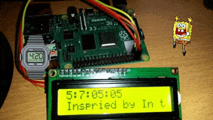

# Countdown the end of year
# LCD
This repository contains all the code for interfacing with a **16x2 character I2C liquid-crystal display (LCD)**. This accompanies my **Youtube tutorial**: [Raspberry Pi - Mini LCD Display Tutorial](https://www.youtube.com/watch?v=fR5XhHYzUK0). 

You can buy one of these great little I2C LCD on eBay or somewhere like [the Pi Hut](https://thepihut.com/search?type=product&q=lcd).

# Installation
* Install git
  ``` 
  sudo apt install git
  ```

* Clone the repo in your `pi` home directory
  ``` 
  cd /home/pi/
  git clone https://github.com/the-raspberry-pi-guy/lcd.git
  cd lcd/
  ```

* Run the automatic installation script with `sudo` permission
  ``` 
  sudo ./install.sh
  ```
Here is mine 


